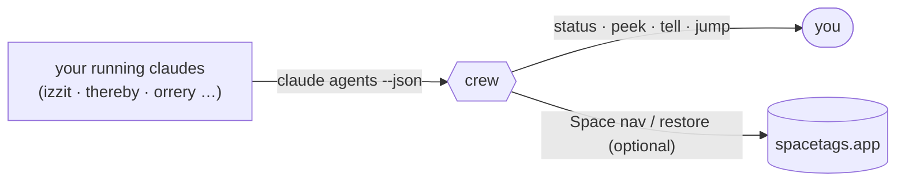

# crew

**htop + a remote for your fleet of Claude Code sessions.**

If you run many `claude` sessions by hand — scattered across terminal windows and
macOS Spaces — crew gives you one place to *see* them, *drive* them, and bring them
all back after a reboot. It does **not** spawn or own sessions (Claude Code's own
Agent view does that, as do Claude Squad / Sculptor / vibe-kanban) — it **attaches to
the ones you already have** and never touches your layout.



## Install

```
brew install kaolin/tap/crew
crew                          # your fleet, grouped by project, needs-you first
brew services start crew      # optional: auto-snapshot every 5 min (reboot safety)
```

From source instead: `git clone https://github.com/kaolin/crew && crew/crew setup`.
macOS + iTerm2; uses the `claude` CLI (Claude Code).

## What it does

| command | what it does |
|---|---|
| `crew` · `crew status` | fleet overview, grouped by project, needs-you first |
| `crew peek <name>` | read a session's screen (read-only) |
| `crew tell <name> "…"` | send a prompt to an **idle** session (refuses `busy` w/o `--force`) |
| `crew jump <name>` | go to where its window *actually* is (+ front it) |
| `crew goto <name>` | go to its *tagged* (intended) Space |
| `crew where <name>` | show actual Space vs. tagged home |
| `crew snapshot` · `crew restore` | save / rebuild the whole layout across a reboot |
| `crew setup` · `crew doctor` | install onto PATH + agent / health-check |

`<name>` resolves by exact name, name-prefix, project, or substring.

## How it works

- **Awareness** — `claude agents --json` (Claude Code ≥ 2.1.139) reports every running
  session, interactive ones included, with cwd / sessionId / name / live status. No
  screen-scraping, no hooks.
- **Dispatch & jump** — resolve a session, join `pid → tty → the live iTerm2 session`,
  and act in place via AppleScript (`write text` / `select` / `contents`).
- **Reboot map** — a launchd agent snapshots the fleet every 5 min into
  `~/.crew/latest.json` (shutdown-safe, keeps history in `~/.crew/history/`). After a
  reboot, `crew restore --go` reopens, places, and resumes every session. Session
  state lives on disk (`~/.claude/projects/…`), so nothing is lost.

## Spaces & spatial restore (optional: spacetags)

crew keeps your macOS-Space layout by delegating all Space navigation to
**[spacetags](https://spacetags.app/)** — a menubar app that labels each Space by
project. crew maps a session to a Space by matching its project to the Space's tag,
then spacetags switches there. Without spacetags, crew still does everything else —
status, dispatch, and conversation restore — it just won't place windows on Spaces.

## Design: attach, don't spawn

Every other tool in this space *owns* its sessions (its own tmux, git worktrees, or
containers). crew is the opposite: it treats your existing, hand-arranged sessions as
the source of truth and stays a thin layer over `claude agents --json` + iTerm2. It
also stays cleanly separated from spacetags — crew is the *session* layer, spacetags
is the *Space* layer, joined by one call.

## Test

```
./test.sh    # runs against fixtures — no live sessions needed
```

stdlib Python 3 only; no pip/conda env.

## License

MIT © Kaolin Fire
