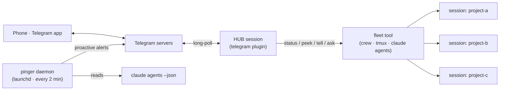

# Reach your Claude Code fleet from your phone

*A real-world setup: monitor and steer many hand-run Claude Code sessions from a phone — over Telegram, using only first-party plugins plus ~150 lines of glue.*

I run around 20 Claude Code sessions at once — one per project, hand-launched across macOS Spaces. I wanted to check on them and nudge them from my phone. The path there is not obvious: five different things sound like the answer, and most of them aren't. This is the map I wish I'd had, plus the exact setup I landed on.

---

## The decision map: five ways to reach Claude Code from your phone

| Option | What it is | Reaches your hand-run terminal sessions? | Verdict |
|---|---|---|---|
| **Claude Cowork** | Cloud knowledge-work product with a GUI | **No** — walled cloud app, no awareness of your terminals | ✗ Wrong tool |
| **Claude Dispatch** | Phone↔desktop bridge *inside* Cowork | **No** — Cowork-only | ✗ Wrong tool |
| **Remote Control** (`claude --remote-control`, `/remote-control`) | Official phone↔session bridge via the Claude app / claude.ai/code | **Yes**, per session | △ Fragile — persistent cloud connection; in my testing it kept dropping and losing messages |
| **Official Channels plugins** (`telegram` / `discord` / `imessage`) | First-party MCP messaging bridge from the `claude-plugins-official` marketplace | **Yes**, per session | ✓ **The pick** — robust transport |
| **Custom relay** (roll your own bot) | Your own script wrapping tmux / `claude -p` | Depends | ✗ Unnecessary once you find the official plugin |

Two of these (Cowork, Dispatch) are a different product for a different job — cloud knowledge work, not driving your terminal. That leaves the real contest: **Remote Control** vs the **official Channels plugins**.

> **Why not just Remote Control?**
> It's official and it works — but it holds a persistent connection to Anthropic's cloud, and when that connection dropped, messages were lost. The official Channels plugins use Telegram's `getUpdates` **long-poll** instead: messages sit durably on Telegram's servers until your Mac acknowledges them by advancing an offset, so a dropped connection just *resumes* and nothing is lost. If Remote Control's flakiness bit you, this is the structural fix.

---

## The catch that shapes everything: one bot = one session

Telegram allows **exactly one `getUpdates` consumer per bot token**. Load the same token in a second session and it gets a `409 Conflict`. So a single bot **cannot** fan out to your whole fleet.

The workaround is the whole architecture:

- Don't bind the bot to all your sessions.
- Point it at **one "hub" session**, and let the hub drive the others through a fleet tool.



Three parts, then: a **transport** (the telegram plugin), a **hub** (one briefed session that drives the fleet), and a **pinger** (a standalone daemon for proactive alerts).

---

## Setup

**Prerequisites:** Claude Code (I used 2.1.215), a claude.ai login (Pro/Max — not an API key), and [Bun](https://bun.sh) (the plugin's MCP server runs on it: `curl -fsSL https://bun.sh/install | bash`).

### 1. Install the transport

Create a bot with [@BotFather](https://t.me/BotFather) (`/newbot` → name → username ending in `bot`). It gives you a token like `123456789:AAH…`. Then, in a Claude Code session:

```
/plugin install telegram@claude-plugins-official
/reload-plugins
/telegram:configure 123456789:AAH…      # writes ~/.claude/channels/telegram/.env
```

Relaunch with the channel flag (the server won't connect without it):

```sh
claude --channels plugin:telegram@claude-plugins-official
```

Pair, then lock down so strangers can't even get a pairing reply:

```
# DM your bot anything → it replies with a 6-char code, then:
/telegram:access pair <code>
/telegram:access policy allowlist
```

**Verify the token before going further** — this catches a bad paste early:

```sh
curl -s "https://api.telegram.org/bot<TOKEN>/getMe"   # -> {"ok":true,"result":{"username":"your_bot",...}}
```

### 2. The hub

The hub is one session, launched with the channel flag, briefed to translate phone messages into fleet commands. My fleet tool is **`crew`** — a small read-only session console I built (`crew status / peek / tell / ask`). Swap in `tmux send-keys`, `claude agents`, or your own script; the pattern is identical.

The brief — `~/.claude/hub-protocol.md` (baked into every launch via `--append-system-prompt`, so it never pollutes a repo):

```markdown
# Telegram Hub — fleet control plane

You are the control hub. Messages arrive from my phone through the `telegram`
channel as <channel> notifications. The sender only sees text you send with the
`reply` tool. So: always reply via that tool, and keep replies SHORT (phone).

Drive the fleet with `crew` (full path: $HOME/dev/crew/crew):
- Whole-fleet status:  crew status
- Look at a session:   crew peek <name>
- Nudge idle session:  crew tell <name> "<prompt>"    (fire-and-forget)
- Nudge and wait:      crew ask  <name> "<prompt>"

Mapping:
- "status" / "what's running" -> crew status, reply with a compact summary.
- "peek X" -> crew peek <name>, reply with a 2-3 line gist.
- "tell X to ..." -> CHANGES state -> see Safety.

Safety (do not skip):
- Before any tell/ask that makes a session DO something, first reply with the
  exact target + exact prompt and ask me to confirm ("reply YES to send"). Only
  run it after an explicit yes.
- Never issue destructive instructions (rm -rf, deleting data, force-push).
- crew tell only works on IDLE sessions; if the target is busy, say so.

You are a remote control, not an autonomous agent. When in doubt, report and ask.
```

The launcher is `crew-hub`, which ships with crew — all it does is append that brief to
a session's system prompt:

```sh
#!/bin/sh
# Launch a Claude Code session as the Telegram control hub for the fleet.
exec claude \
  --name hub \
  --channels plugin:telegram@claude-plugins-official \
  --append-system-prompt "$(cat "$HOME/.claude/hub-protocol.md")" \
  "$@"
```

(The shipped version also resolves `$HUB_PROTOCOL` and fails with a useful message
rather than starting brief-less, but that's the whole idea.)

Run `crew-hub` and you have a phone-reachable hub. From the phone: `status` → fleet
summary; `peek project-a` → what it's doing; `tell project-a to run its tests` → routed
to that session. Decide your own confirm-gate policy in the brief — mine sends anything
I dictated straight through, and confirms only for things the hub composed itself or
anything destructive. Making yourself say YES to your own words is friction, not safety;
making a hub confirm before it improvises is the part that matters.

### 3. The pinger (proactive alerts)

The hub is *reactive* — it answers when you message it. For *proactive* "come look" pings you need a separate watcher.

Here's the honest constraint: **`claude agents --json` has no "blocked/waiting" state — only `idle` and `busy`.** So there's no clean "this session is stuck on a prompt" signal at the fleet level. The two transitions you *can* detect are:

- **Finished** — `busy → idle` after a busy episode longer than a threshold (filters out trivial per-turn chatter; catches "my long task is done").
- **Stuck** — `busy` continuously for hours (catches hung / blocked sessions).

A standalone [launchd](https://www.launchd.info/) daemon polls every couple of minutes and pushes a Telegram message straight through the bot API — independent of the hub, so alerts arrive even if the hub is down. It has **no dependency on crew** — it only reads `claude agents --json` and the plugin's token file, so it works for anyone running the telegram plugin.

`$HOME/dev/crew/pinger/tick.py` (stdlib-only — edit the paths in the header block):

```python
#!/usr/bin/env python3
"""Watch the Claude fleet and Telegram-alert on state changes. Run once per
launchd invocation. Detects, by diffing against state.json:
  FINISHED — busy -> idle after >= MIN_FINISHED_SECS (filters per-turn chatter)
  STUCK    — busy continuously >= STUCK_HOURS (once per episode)
There is no blocked/waiting flag in `claude agents --json` (idle/busy only),
so these two transitions are the only honest signals."""
import json, os, subprocess, sys, time, urllib.request, urllib.parse

HOME        = os.path.expanduser("~")
CLAUDE      = f"{HOME}/.local/bin/claude"          # <- absolute; launchd has no shell PATH
ENV_PATH    = f"{HOME}/.claude/channels/telegram/.env"
ACCESS_PATH = f"{HOME}/.claude/channels/telegram/access.json"
STATE_PATH  = f"{HOME}/dev/crew/pinger/state.json"
LOG_PATH    = f"{HOME}/dev/crew/pinger/pinger.log"

NOTIFY_FINISHED   = True
NOTIFY_STUCK      = True
MIN_FINISHED_SECS = 120        # only ping "finished" for busy episodes >= this
STUCK_HOURS       = 3.0        # busy this long with no change -> "may be hung"
EXCLUDE_NAMES     = {"hub"}     # never ping about these (the hub itself)
QUIET_HOURS       = None       # e.g. (23, 8) to mute 23:00-08:00 local; None = off


def log(msg):
    try:
        with open(LOG_PATH, "a") as f:
            f.write(f"{time.strftime('%Y-%m-%d %H:%M:%S')}  {msg}\n")
    except OSError:
        pass


def load_token():
    try:
        for line in open(ENV_PATH):
            if line.strip().startswith("TELEGRAM_BOT_TOKEN="):
                return line.strip().split("=", 1)[1]
    except OSError:
        pass
    return os.environ.get("TELEGRAM_BOT_TOKEN")


def load_chats():
    try:
        return [str(c) for c in json.load(open(ACCESS_PATH)).get("allowFrom", [])]
    except (OSError, ValueError):
        return []


def get_sessions():
    try:
        out = subprocess.run([CLAUDE, "agents", "--json"],
                             capture_output=True, text=True, timeout=60)
        if out.returncode != 0:
            log(f"claude agents failed rc={out.returncode}: {out.stderr[:200]}")
            return None
        return json.loads(out.stdout)
    except Exception as e:                      # daemon must never crash
        log(f"get_sessions error: {e}")
        return None


def send(token, chat, text):
    data = urllib.parse.urlencode({"chat_id": chat, "text": text}).encode()
    url = f"https://api.telegram.org/bot{token}/sendMessage"
    try:
        with urllib.request.urlopen(urllib.request.Request(url, data=data), timeout=20) as r:
            r.read()
        return True
    except Exception as e:
        log(f"send to {chat} failed: {e}")
        return False


def in_quiet_hours(now):
    if not QUIET_HOURS:
        return False
    h, (a, b) = time.localtime(now).tm_hour, QUIET_HOURS
    return (a <= h or h < b) if a > b else (a <= h < b)


def main():
    now = time.time()

    if "--test" in sys.argv:
        token, chats = load_token(), load_chats()
        ok = all(send(token, c, "crew-pinger test — alerts are wired.") for c in chats)
        print("test sent, ok=", ok, "chats=", chats)
        return

    sessions = get_sessions()
    if sessions is None:
        return                                  # transient; launchd retries next interval

    try:
        state = json.load(open(STATE_PATH))
    except (OSError, ValueError):
        state = {}
    prev, first_run = state.get("sessions", {}), not state.get("initialized")

    events, new = [], {}
    for s in sessions:
        sid, name, status = s["sessionId"], s["name"], s["status"]
        proj = os.path.basename(s.get("cwd", "")) or "?"
        p = prev.get(sid, {})
        if status == "busy":
            busy_since = p.get("busy_since") if p.get("status") == "busy" and p.get("busy_since") else now
            notified = bool(p.get("notified_stuck"))
            if (NOTIFY_STUCK and not notified and not first_run and name not in EXCLUDE_NAMES
                    and (now - busy_since) >= STUCK_HOURS * 3600):
                events.append(f"[stuck]  {name} ({proj}) busy {(now-busy_since)/3600:.1f}h — may be hung")
                notified = True
            new[sid] = {"name": name, "cwd": s.get("cwd"), "status": status,
                        "busy_since": busy_since, "notified_stuck": notified}
        else:
            if (NOTIFY_FINISHED and not first_run and name not in EXCLUDE_NAMES
                    and p.get("status") == "busy" and p.get("busy_since")
                    and (now - p["busy_since"]) >= MIN_FINISHED_SECS):
                events.append(f"[done]   {name} ({proj}) finished after {(now-p['busy_since'])/60:.0f}m")
            new[sid] = {"name": name, "cwd": s.get("cwd"), "status": status,
                        "busy_since": None, "notified_stuck": False}

    tmp = STATE_PATH + ".tmp"
    json.dump({"initialized": True, "updated": now, "sessions": new}, open(tmp, "w"), indent=2)
    os.replace(tmp, STATE_PATH)

    if events and not in_quiet_hours(now):
        token, chats = load_token(), load_chats()
        msg = "crew\n" + "\n".join(events)
        for c in chats:
            send(token, c, msg)
        log(f"sent {len(events)} event(s) to {len(chats)} chat(s)")
    else:
        log(f"tick ok: {len(sessions)} sessions, {len(events)} event(s)"
            f"{' (seeded)' if first_run else ''}")


if __name__ == "__main__":
    main()
```

The launchd agent — `~/Library/LaunchAgents/com.example.crew-pinger.plist`:

```xml
<?xml version="1.0" encoding="UTF-8"?>
<!DOCTYPE plist PUBLIC "-//Apple//DTD PLIST 1.0//EN" "http://www.apple.com/DTDs/PropertyList-1.0.dtd">
<plist version="1.0">
<dict>
    <key>Label</key>            <string>com.example.crew-pinger</string>
    <key>ProgramArguments</key>
    <array>
        <string>/path/to/python3</string>
        <string>/Users/you/dev/crew/pinger/tick.py</string>
    </array>
    <key>StartInterval</key>    <integer>120</integer>
    <key>RunAtLoad</key>        <true/>
    <key>StandardOutPath</key>  <string>/Users/you/dev/crew/pinger/pinger.out.log</string>
    <key>StandardErrorPath</key><string>/Users/you/dev/crew/pinger/pinger.err.log</string>
</dict>
</plist>
```

Seed state without alerting, fire a live test, then load the agent:

```sh
python3 ~/dev/crew/pinger/tick.py            # first run seeds state.json, alerts nothing
python3 ~/dev/crew/pinger/tick.py --test     # sends you a live Telegram message
launchctl bootstrap gui/$(id -u) ~/Library/LaunchAgents/com.example.crew-pinger.plist
launchctl list | grep crew-pinger            # confirm it's registered
```

---

## Managing & tuning

```sh
tail -f ~/dev/crew/pinger/pinger.log                 # watch it work
python3 ~/dev/crew/pinger/tick.py --test             # send yourself a test ping
launchctl bootout  gui/$(id -u)/com.example.crew-pinger    # stop
launchctl bootstrap gui/$(id -u) ~/Library/LaunchAgents/com.example.crew-pinger.plist  # start
```

Tunables live at the top of `tick.py` — `MIN_FINISHED_SECS`, `STUCK_HOURS`, `EXCLUDE_NAMES`, and `QUIET_HOURS = (23, 8)` to mute overnight. Edits take effect on the next tick; no reload needed.

---

## Honest notes & gotchas

- **One bot ↔ one session** — Telegram-enforced. Reach many sessions through a hub, not by sharing a token.
- **The hub is a TUI** — it does not survive a reboot; relaunch it (or restore it with your session manager). The **pinger is a launchd agent** and *does* auto-load at login.
- **No "blocked" signal** — `claude agents --json` is `idle`/`busy` only. The pinger keys off `busy↔idle` transitions; it cannot tell "waiting on a permission prompt" apart from "idle and done." (The telegram plugin *does* relay permission prompts — but only for the session it's attached to, i.e. the hub.)
- **Keep the token out of git** — it lives in `~/.claude/channels/telegram/.env`; add `~/.claude/channels/` to your ignore rules.
- **Discord & iMessage exist too.** Same marketplace ships `discord` and `imessage` plugins. Note Discord's gateway is a *persistent websocket* — closer to the model that made Remote Control flaky — so if drops burned you, prefer Telegram's long-poll.

---

## What generalizes

- **The decision map** applies to anyone with more than one session.
- **The hub + fan-out pattern** — swap `crew` for `tmux send-keys` or `claude agents`; the one-bot-one-session workaround is the same.
- **The pinger** is standalone: no `crew`, no hub — just `claude agents --json` + the telegram plugin's token. Drop it in as-is.
